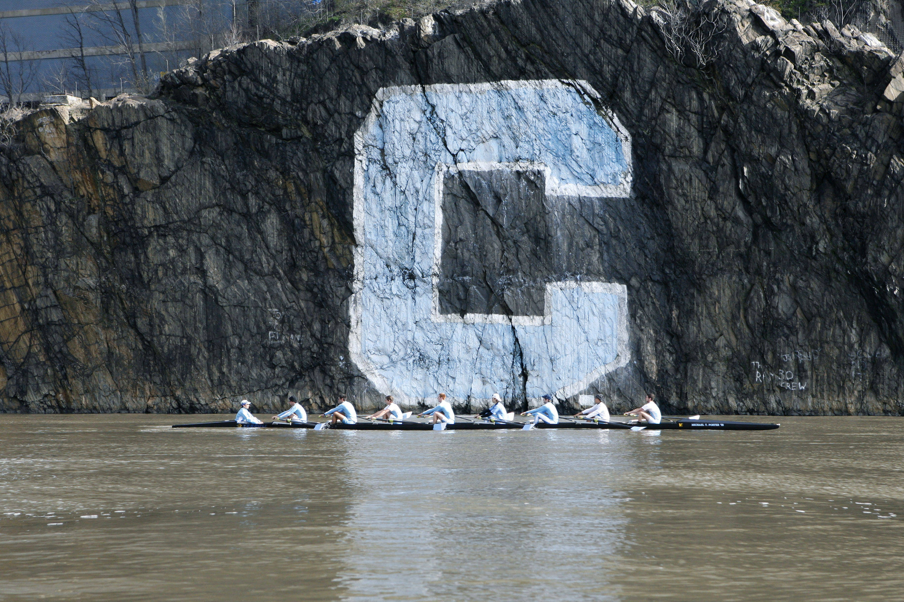

# US Olympic & Columbia University Rowing Team 
## Training Analysis and Workflow for Better Performance

## Objective

This project provided an analysis and proposal for the US and Columbia team rowing outlining better ways to measure and display training progress of their respective teams. The coaching staffs have all of the experience and knowledge of the sport to make a decision based on observation, but they need enhanced abilities to look at the big picture context of the program as a whole. There is inevitable bias when taking the subjective observation, even if that comes from an expert who may have the correct 'feel' for an athlete from that. 

Our goal was to look at a rowing teams training, preparation, and analysis of performance from a holistic perspective. This means that it included a better way for coaches to unify dashboards showing performance trends, as well as giving athletes an avenue to monitor their own progress athletically and mentally. In addition to monitoring the performance statistics that are quantifiable for the team, we also created a system to quantify mental and emotional health progression. 

**Hypothesis: Mentally and emotionally well- balanced athletes lead to faster rowing times.**

## Data Analysis and findings

The data provided was in multiple avenues based on the team: 
- Columbia: Provided with result data from students prior to starting on the rowing team the current year.
- US Rowing: Provided data results based on performance done in trials for individual team members. RPE data was provided where accessible for each test session, but it was not consistent. 

#### Results: When it comes to general performance, we have found that the US Rowing team shows more correlation with a higher RPE to better performance as opposed to the Columbia rowing team. The Columbia rowing data showed a slighly negative correlation between a student's answers to the wellness check. 

The factors that could have affected these results: 
- RPE measurment is a self reported stat from the athlete on the time of the trial. The mental health quiz provided by Columbia was more encompassing than that. 
- US Rowing athletes are more singularly focused on the goal, therefore their RPE (and mental preparation for the trial) could be more focused to the competition, as opposed to student athletes who deal with a wider variety of focuses at any given time. 
- Between the two teams there were a collective of 20 athletes looked at, for which data that was gathered was inconsistent for many. 

## Training scheduling and workflow management 
In order to best prepare teams for success in competition, our team proposed a system of tracking performance based data with the mental health aspect of an athletes preparation for competition. 

